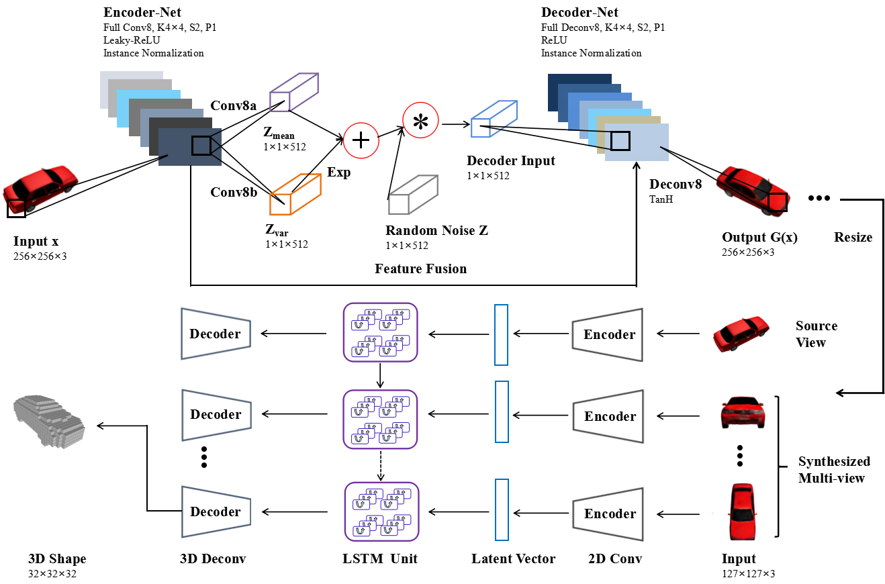

# Structure-Aware 3D Shape Synthesis from Single-View Images [[Paper]](http://www.bmva.org/bmvc/2018/contents/papers/0763.pdf)

TensorFlow implementation for “Structure-Aware 3D Shape Synthesis from Single-View Images”.

<p align="center">

</p>

## Dependencies
```
Python>=3.5, TensorFlow>=1.4, numpy, scipy, matplotlib
```
## Dataset
We use ShapeNet dataset [Download dataset], password: eq1v.

## Testing
Results of our [Download pretrained models](https://pan.baidu.com/s/1RySrR54rbUMuvl3uwdYOHg), password: 3j2z:

```bash
python main.py --phase test --mode $MODE$ --test_data_path $DATA_DIR$ --pretrained_model_path $PRETRAINED_MODEL$
```

- MODE: src viewpoint to dst viewpoint, such as leftside_to_rightside
- DATA_DIR: path to test data path
- PRETRAINED_MODEL: path of the pretrained model

Then, you can use [3D-R2N2](https://github.com/chrischoy/3D-R2N2) test based on the synthesis images.

## Training
```bash
python main.py --phase train --data_path $DATA_DIR$ --mode $MODE$
```

- DATA_DIR: path to train data path
- MODE: src viewpoint to dst viewpoint, such as leftside_to_rightside

Then, you can use [3D-R2N2](https://github.com/chrischoy/3D-R2N2) train based on the synthesis images.

## Citation

If you use any part of this code in your research, please cite our paper:

```
@inproceedings{hu2020structure,
  title={Structure-Aware 3D Shape Synthesis from Single-View Images},
  author={Xuyang Hu, Fan Zhu, Li Liu, Jin Xie, Jun Tang, Nian Wang, Fumin Shen, and Ling Shao},
  booktitle={Proceedings of the 29th British Machine Vision Conference},
  year={2018}
}
```

## Acknowledge
The code is built on [CycleGAN (TensorFlow)](https://github.com/XHUJOY/CycleGAN-tensorflow) and [3D-R2N2](https://github.com/chrischoy/3D-R2N2). We thank the authors for sharing the codes.